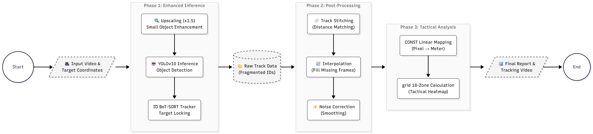
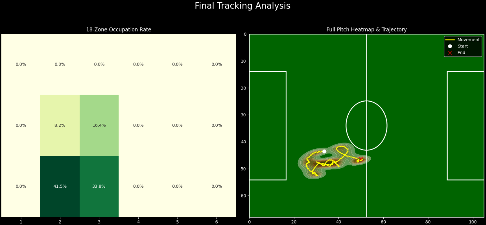

# ⚽ Advanced Football Player Tracking System
> **Logic over Model**: robust player tracking pipeline using post-processing algorithms without heavy Re-ID models.


## 📌 Project Overview
This project implements an advanced pipeline to track a specific player in broadcast football videos and analyze their movements (e.g., **18-Zone occupation**, **Heatmap**). 
Instead of relying solely on heavy Deep Learning models for Re-Identification, I focused on **Data Engineering logic (Post-processing)** to solve common issues like occlusion and ID switching, optimizing for both performance and computational efficiency.

## 🛠️ Architecture Pipeline


## 💥 The Challenge
Tracking players in broadcast footage presents three major difficulties:
1.  **Frequent ID Switching**: Tracker IDs often switch when players cross paths or are occluded by others.
2.  **Small Object Failure**: In long-shot views, players appear too small, causing detection failures (False Negatives).
3.  **Resource Constraints**: Using heavy Re-ID models (like DeepSORT with large feature extractors) increases latency, making it unsuitable for rapid analysis.

## 💡 Solution: "Logic over Model"
I addressed these challenges by enhancing the inference process and implementing robust post-processing logic.

### 1. Spatio-temporal Track Stitching
To reconnect broken track IDs, I implemented a **heuristic stitching algorithm** based on spatio-temporal distance.
* **Logic**: If a target ID disappears, the system searches for new IDs appearing within `N` frames.
* **Matching**: If the Euclidean distance between the last known position and the new ID's start position is within a threshold (`150px`), they are merged into a single trajectory.

### 2. Upscaling Inference Strategy
To improve detection recall for small objects:
* The input frames are **upscaled by 1.5x** during the inference phase.
* **Result**: This significantly sharpens the player's features, allowing YOLO to detect objects that were previously missed.

### 3. Data Interpolation
Using **Linear Interpolation** (via Pandas), the system fills in missing frames where detection failed, ensuring a smooth and continuous trajectory.

## ⚖️ Trade-offs
* **Linear Mapping vs. Homography**: Instead of a complex homography matrix, I used **Linear Mapping** for coordinate conversion. While less physically precise, it is computationally cheaper and sufficient for **tactical analysis (Zone 14, Heatmaps)**.
* **Heuristic Stitching**: Since I prioritized speed over deep feature matching, there is a slight risk of ID mismatch in extremely crowded scenes. However, this trade-off provides a massive speed advantage over Re-ID models.

## 💻 Tech Stack
* **Core**: Python, OpenCV, Pandas
* **AI/ML**: YOLOv10 (Object Detection + BoT-SORT Tracker)
* **Visualization**: Matplotlib, Seaborn

## 🚀 Usage

### 1. Installation
```
pip install -r requirements.txt
```
### 2. Run Analysis
You need to specify the input video and the initial (x, y) coordinates of the target player.
```
# Example: Track a player starting at (300, 360)
python football_tracker.py --video ./data/match_clip.mp4 --tx 300 --ty 360 --output ./results/final_output.mp4
```

📊 Results
Below is an example of the generated tactical heatmap and trajectory analysis.




👨‍💻 Author
Seo Su-bin

Dept. of Computer Science (AI Computing), Kyungpook National University

📜 License
This project is licensed under the MIT License.
